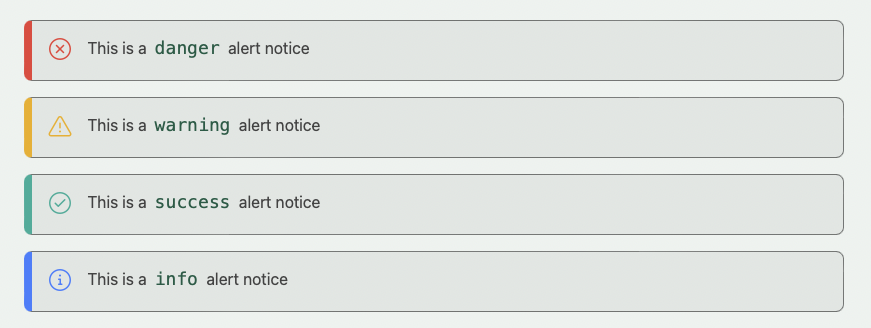
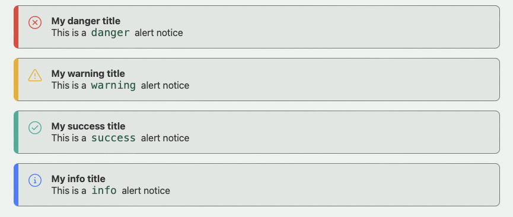
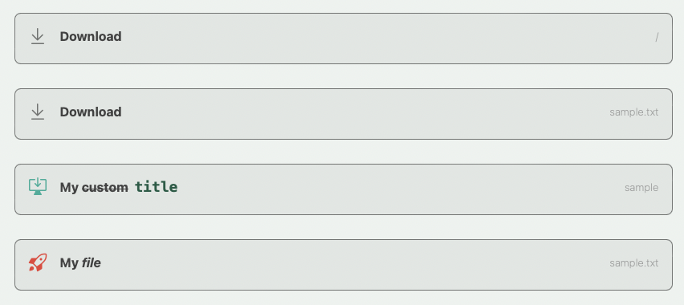

# Extra Components for Publish

A collection of additional components which can be used throughout a Publish site in the markdown.

## Installation

To install it into your Publish package, add it as a dependency within your `Package.swift` manifest:

```swift
let package = Package(
  dependencies: [
    .package(name: "ExtraComponents", url: "https://github.com/markbattistella/extra-components-publish-plugin", from: "1.0.0")
  ],
  targets: [
    .target(
      dependencies: [
        "ExtraComponents"
	  ]
	)
  ]
)
```

Then import `ExtraComponents` wherever you’d like to use it:

```swift
import ExtraComponents
```

For more information on how to use the Swift Package Manager, check out [its official documentation](https://github.com/apple/swift-package-manager/tree/master/Documentation).

## Usage

The plugin can then be used within any publishing pipeline like this:

```swift
import ExtraComponents

try DeliciousRecipes().publish(using: [
  .installPlugin(.addExtraComponents())
])
```

By default it will add in the [default CSS](/Sources/ExtraComponents/Support/extra-components.css) files from the plugin to help style your components.

However if you wish to add your own in your main CSS file, install the plugin by:

```swift
import ExtraComponents

try DeliciousRecipes().publish(using: [
  .installPlugin(.addExtraComponents(addCss: false))
])
```

## Contributing

I have a very basic knowledge on the world of Swift, and particularly outisde iOS.

For this, I've turned off Issues and if you wish to add/change the codebase please create a Pull Request.

This way everyone can allow these components to grow, and be the best rather than waiting on me to write it.

### How to help

1. Clone the repo: `git clone https://github.com/markbattistella/extra-components-publish-plugin.git`
1. Create your feature branch: `git checkout -b my-feature`
1. Commit your changes: `git commit -am 'Add some feature'`
1. Push to the branch: `git push origin my-new-feature`
1. Submit the pull request

## Components

### Alerts

There are four types of alerts: danger, warning, success, and information.

You can add these to your mardown documents by using the blackquote syntax with the prefix signifier:

```markdown
> ! This is a `danger` alert notice

> % This is a `warning` alert notice

> / This is a `success` alert notice

> ? This is a `info` alert notice
```



| Signifier | Output type   |
|-----------|---------------|
| `!`       | Danger alert  |
| `%`       | Warning alert |
| `/`       | Success alert |
| `?`       | Info alert    |

#### Title

You can also add titles to your alert notices by adding a `:` before the title, and a new line for the body text:

```markdown
> ! :My danger title
This is a `danger` alert notice

> % :My warning title
This is a `warning` alert notice

> / :My success title
This is a `success` alert notice

> ? :My info title
This is a `info` alert notice
```



### Downloads and Reference links

Downloads and referecne links are very similar in design, implementation, use, with the major difference being a forced file download for the `Download` option, and a link to for references.

#### Downloads

Downloads should be added on a newline with a spaces around it. It will cause issues if used within a block of text.

The deisgn for this is for you can add a nice big download button for people to be able to get any attachments you are providing.

There are different attributes you can add to downloads. These are:

| Attribute | Output                                                         |
|-----------|----------------------------------------------------------------|
| `:title`  | The label for the button                                       |
| `:theme`  | The class that is appended to the div container                |
| `:icon`   | The SVG icon that will be added to the left side of the button |

##### Example

```markdown
[:file](/)

[:file](static/sample.txt)

[:file :title="My ~~custom~~ `title`" :theme="green" :icon="desktopDownload"](static/sample.txt)

[:file :title="My *file*" :theme=red :icon=rocket](static/sample.txt)
```



#### Reference links

Reference links, though very similar to downloads, are designed for referencing other links within your Publish site, or external site.

Similarly there are also attributes you can use in references:

| Attribute | Output                                                         |
|-----------|----------------------------------------------------------------|
| `:title`  | The label for the button                                       |
| `:theme`  | The class that is appended to the div container                |
| `:icon`   | The SVG icon that will be added to the left side of the button |
| `:target` | Whether to open in same page or new page                       |

```markdown
[:ref](/)

[:ref :title="This is my custom title"](/cars)

[:ref :title="Custom title" :icon="rocket"](/section/dogs/sausage-dogs)

[:ref :title="Custom title" :target="_blank"](../home/file/item/)
```


## Icons

There are over 200 avaialble icons to use based on the [Primer/Octicons](https://github.com/primer/octicons) repo.

You can find the list here of all the avaialble icons: https://octicons-primer.vercel.app/octicons/

Any icons that have a hypen in its name (eg. `person-fill` can be accessed by the camel case notation `personFill`).
